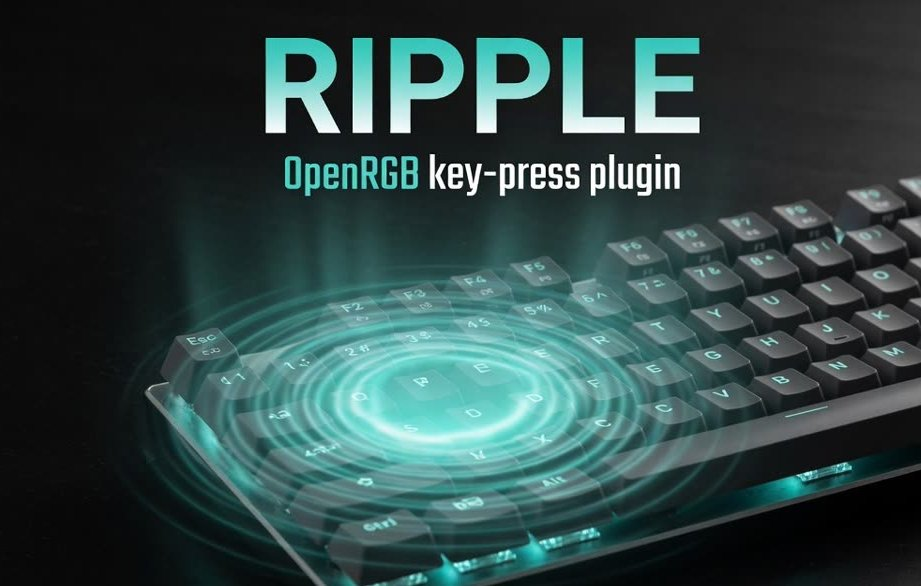
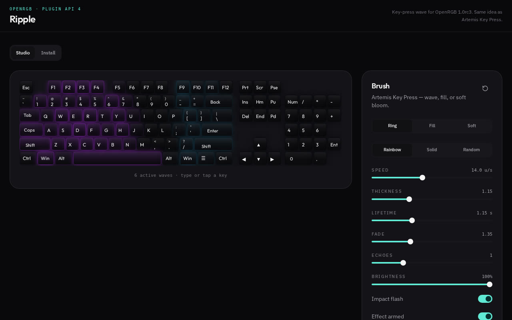

# Ripple

Artemis-style key-press ripple for [OpenRGB](https://openrgb.org).  
Windows plugin · API 4 · OpenRGB 1.0rc2 / 1.0rc3

<p align="center">
  
</p>

Press a key and a wave expands from that LED — ring, fill, or soft. Rainbow, solid, or random. It is a real OpenRGB plugin (`Ripple` tab), not a sidecar exe.

**[Download OpenRGBRipplePlugin.dll](https://github.com/camAtGitHub/openRGB-ripple-plugin/releases/latest/download/OpenRGBRipplePlugin.dll)**

The plugin installs a Windows keyboard-hook, which may trigger an antivirus false positive. No issues with Microsoft Defender at present.

The effect is inspired by [Artemis 2](https://github.com/Artemis-RGB/Artemis) Key Press. Their code is not used.

## Studio

GitHub will not run this page inside the README. Click the screenshot for the [live preview](https://camatgithub.github.io/openRGB-ripple-plugin/).

<p align="center">
  <a href="https://camatgithub.github.io/openRGB-ripple-plugin/">
    
  </a>
</p>

```bash
npm install
npm run dev      # http://localhost:8080
npm run build    # static files in dist/
```

Repo: [camAtGitHub/openRGB-ripple-plugin](https://github.com/camAtGitHub/openRGB-ripple-plugin).  
Pages is wired in `.github/workflows/pages.yml` — after this landing is pushed, set **Settings → Pages → Source: GitHub Actions**.

## Build the plugin

Needs Visual Studio 2022 (**Desktop development with C++**) and Python 3 the first time (to fetch Qt 5.15).

```powershell
cd OpenRGBRipplePlugin
powershell -ExecutionPolicy Bypass -File .\build-plugin.ps1
```

That builds `OpenRGBRipplePlugin.dll` and copies it to `%APPDATA%\OpenRGB\plugins`. Restart OpenRGB and open the **Ripple** tab. Pass `-NoInstall` to skip the copy (CI / just produce the DLL).

Details and the config table: [`OpenRGBRipplePlugin/README.md`](OpenRGBRipplePlugin/README.md).

Do **not** run `OpenRGBRipple.exe` at the same time — both would paint the keyboard.

A standalone SDK client (no Qt) lives in [`OpenRGBRipplePlugin/sdk-client/`](OpenRGBRipplePlugin/sdk-client/).

## License

GPL-2.0-or-later, same as OpenRGB.
